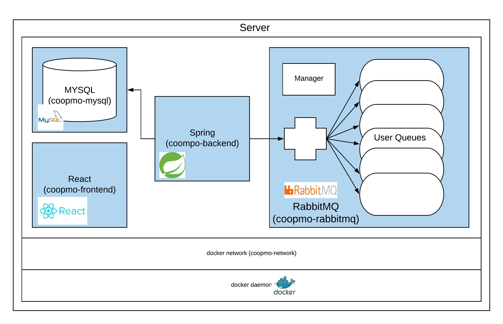

# coopmo
/badge.svg)

Venmo Clone for Final Project for ECE-366 (Software Engineering Cooper Union)

## Overview

*Backend System Overview of Coopmo*
## REQUIREMENT
* Spring
* MySQL
* React
* RabbitMQ

## USAGE
```
git clone https://github.com/thedavekwon/coopmo.git
cd coopmo
```

### Docker
```
# using docker-compose
docker-compose build
docker-compose up
```

### Local
```
mvn clean install

# run the program
mvn spring-boot:run
# or 
mvn -jar target/coopmo-{VERSION}-SNAPSHOT.jar

# run the test (demo)
mvn test

# to set up database
mysql < createdb.sh

# to set up react
cd client
npm install
npm start
```

